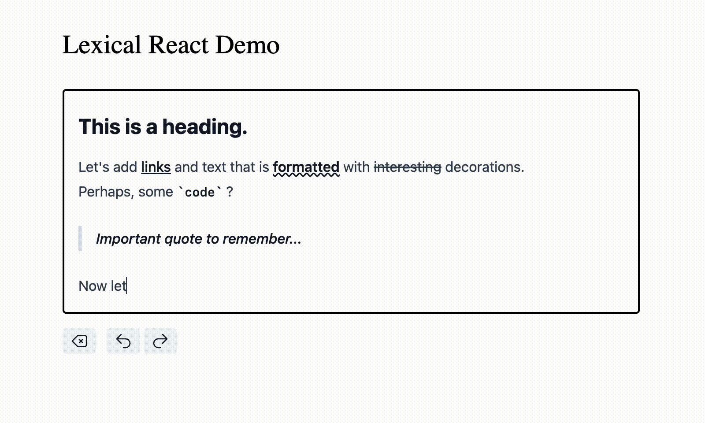

# ✍️ Rich Text Editor w/ Lexical & React

A simple wysiwyg / rich text editor built with Lexical and React. I built this demo project for my blog post on how to use Lexical. Feel free to browse, fork, and clone this repository.

📌 Live Demo: [lexical-rich-text-react-demo.vercel.app](https://lexical-rich-text-react-demo.vercel.app/)

📌 Blog Post: [How To Build A Text Editor With Lexical and React](https://konstantin.digital/blog/how-to-build-a-text-editor-with-lexical-and-react)

---



---

## Features

- **Floating Menu** Format selected text easily
- **Markdown Support** Use Markdown syntax, such as `##`
- **Local Storage** Persist your content locally
- **History** Undo/Redo changes with just a click

Note: The feature set is far from complete. It should only show how to approach most common text editing features.

## Installation

```sh
git clone https://github.com/konstantinmuenster/lexical-rich-text-react-demo.git
cd lexical-rich-text-react-demo
pnpm install # or npm install
pnpm run dev # or npm run dev
```

## About

<a href="https://www.buymeacoffee.com/kmuenster" target="_blank"></a>

Konstantin Münster – [konstantin.digital](https://konstantin.digital)

Distributed under the [MIT](http://showalicense.com/?fullname=Konstantin+M%C3%BCnster&year=2019#license-mit) license.
See `LICENSE` for more information.

[https://github.com/konstantinmuenster](https://github.com/konstantinmuenster)
